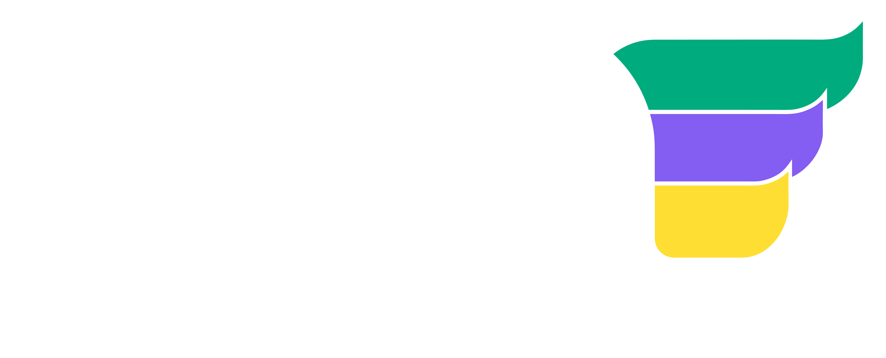
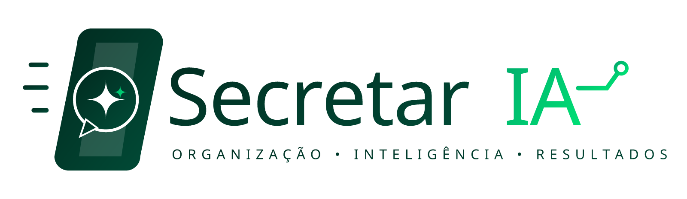

<p align="center">
  
  &nbsp;&nbsp;&nbsp;&nbsp;&nbsp;&nbsp;&nbsp;&nbsp;&nbsp;&nbsp;&nbsp;&nbsp;
  
</p>

<div align="center">

<h1> SecretarIA</h1>

<p align="center">
  
</p>

### <i>Conectando Estudantes e Equipe ASA através da Inteligência Artificial</i>

[](https://www.fecap.br)<br>
[](#)<br>
[](https://creativecommons.org/licenses/by/4.0/)

---

<b>Solução desenvolvida pelo Grupo SecretarIA para a Área do Sucesso Alvarista</b><br>
<a href="https://github.com/2026-2-NCC5/Projeto9">Repositório Oficial</a>

<br><br>

<p align="center">
  
  &nbsp;&nbsp;&nbsp;&nbsp;&nbsp;&nbsp;&nbsp;&nbsp;
  
</p>

<p align="center">
  <b>Nicolly Silva Soares</b>
  &nbsp;&nbsp;&nbsp;&nbsp;&nbsp;&nbsp;&nbsp;&nbsp;&nbsp;&nbsp;&nbsp;&nbsp;
  <b>Fernanda Loura</b>
</p>

</div>

---

## 💡 Sobre o SecretarIA

A **Área do Sucesso Alvarista (ASA)** centraliza o acolhimento, orientação e acompanhamento dos estudantes da FECAP. O **SecretarIA** foi projetado para atuar como uma ponte inteligente entre a comunidade acadêmica e a equipe institucional, trazendo eficiência para dois públicos principais:

<div align="center">

| 🎓 Para os Estudantes | 💼 Para os Funcionários do ASA |
| :--- | :--- |
| **Autoatendimento 24/7:** Respostas imediatas e contextualizadas sobre serviços, regimentos, prazos e documentos. | **Redução de Carga Operacional:** Triagem automática de chamados repetitivos e dúvidas frequentes. |
| **Clareza e Transparência:** Guias passo a passo com indicação explícita das fontes oficiais e data de atualização. | **Apoio à Decisão & Transbordo:** Encaminhamento estruturado dos casos complexos para atendimento humano qualificado. |

</div>

---

## Especificação Tecnológica dos Agentes

```text
                       ┌─────────────────────────────────────────┐
                       │          Estudante / Atendente          │
                       └────────────────────┬────────────────────┘
                                            │ Pergunta / Consulta
                                            ▼
                       ┌─────────────────────────────────────────┐
                       │             🤖 Secretar.IA              │
                       │     (Triagem, RAG e Guardrails)         │
                       └───────────┬─────────────────┬───────────┘
                                   │                 │
                Consulta Semântica │                 │ Caso Complexo / Transbordo
                                   ▼                 ▼
     ┌───────────────────────────────────────┐   ┌───────────────────────┐
     │  Base de Conhecimento Oficial ASA/FECAP│   │ Atendimento Humano    │
     │  • Regimentos, Guias e Portais        │   │ • Equipe do ASA       │
     │  • Fontes com Data de Atualização     │   └───────────────────────┘
     └───────────────────────────────────────┘
```

---

## 🎯 O que o SecretarIA resolve?

O **SecretarIA** ataca os gargalos críticos no atendimento acadêmico e operacional da **Área do Sucesso Alvarista (ASA)** na FECAP:

* **Informação Espalhada e Burocrática:** Elimina a necessidade de o estudante ler manuais e PDFs extensos de 10 páginas para tirar dúvidas simples.
* **Inconsistência nas Respostas:** Evita orientações divergentes entre diferentes canais ou atendentes, centralizando a consulta em uma única **Base de Conhecimento Oficial**.
* **Filas e Lentidão no Atendimento:** Reduz o tempo de espera através de um autoatendimento instantâneo 24/7 para dúvidas recorrentes.
* **Respostas Genéricas:** Conecta a dúvida ao perfil do estudante (via simulação/mock do **TOTVS**), fornecendo orientações direcionadas à situação real do aluno.
* **Sobrecarga da Equipe do ASA:** Filtra chamados repetitivos, permitindo que os atendentes e especialistas foquem nos casos mais complexos.

---

## Por que deve-se usar o SecretarIA?

| Benefício | Para os Estudantes | Para os Funcionários do ASA |
| :--- | :--- | :--- |
| **Respostas Rápidas e Precisas** | Recebem instruções curtas (2 a 3 linhas), objetivas e passo a passo. | Reduzem o volume de chamados operacionais repetitivos. |
| **Fontes Oficiais e Confiáveis** | Garantia de veracidade com indicação expressa da fonte e data de atualização. | Consultam rapidamente regulamentos e históricos centralizados. |
| **Experiência Personalizada** | Orientação adaptada ao status acadêmico do aluno (via integração TOTVS). | Recebem o histórico contextualizado ao assumir um transbordo humano. |
| **Conformidade e Segurança** | Privacidade garantida sob as diretrizes da **LGPD** e controle de perfil. | Rastreabilidade e transparência no histórico de consultas. |

---

## ⚙️ Como rodar o projeto / Configuração para desenvolvimento

### 📋 Pré-requisitos
* **Python 3.10+** (para o Backend e serviços de IA)
* **Node.js 18+** (para o Frontend)
* **Git** instalado no ambiente local

### Passo a Passo

#### 1. Clonar o Repositório
```bash
git clone [https://github.com/2026-2-NCC5/Projeto9.git](https://github.com/2026-2-NCC5/Projeto9.git)
cd Projeto9
```

#### 2. Configurar Variáveis de Ambiente
Crie um arquivo `.env` na raiz da pasta `src/backend/` com base no arquivo `.env.example`:
```env
PORT=8080
DATABASE_URL=
LLM_API_KEY=
TOTVS_MOCK_ENABLED=true
```

#### 3. Executar o Backend
```bash
cd src/backend
pip install -r requirements.txt
python main.py
```

#### 4. Executar o Frontend
```bash
cd ../frontend
npm install
npm run dev
```

---

## 🛠️ Tecnologias Utilizadas

<div align="center">

| Camada | Tecnologias & Ferramentas |
| :--- | :--- |
| **Inteligência Artificial & RAG** | Python, LangChain / LlamaIndex, Modelos LLM, Vector Embeddings |
| **Prototipagem & Experimentos** | Google Colab (Notebooks de teste dos modelos de IA) |
| **Backend & APIs** | Python (FastAPI / Flask), REST APIs, Camada de Integração (TOTVS Mock) |
| **Frontend / Interface** | HTML5, CSS3, JavaScript / React (Interface do Chatbot e Painel ASA) |
| **Banco de Dados** | Banco Relacional (Metadata) + Banco Vetorial (Busca Semântica) |
| **Infraestrutura & Nuvem** | Docker, Linux, Git, GitHub, Serviços de Nuvem (AWS/Azure/GCP) |
| **Qualidade & Processos** | Conventional Commits, LGPD Compliance, Linters |

</div>
